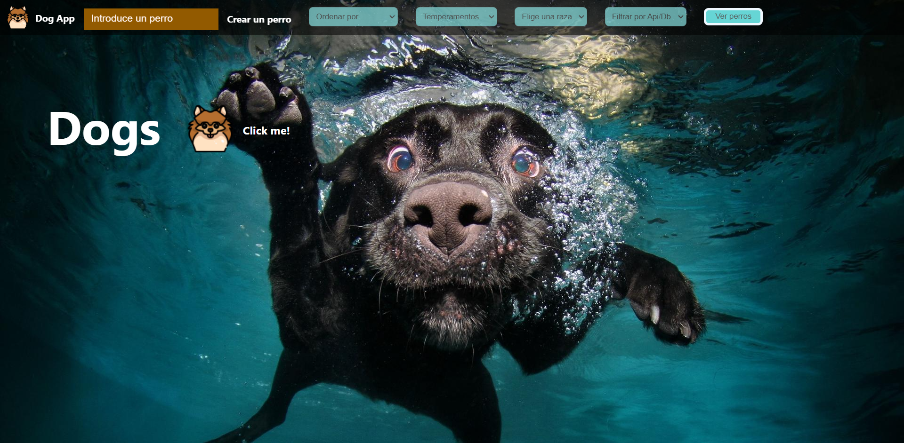
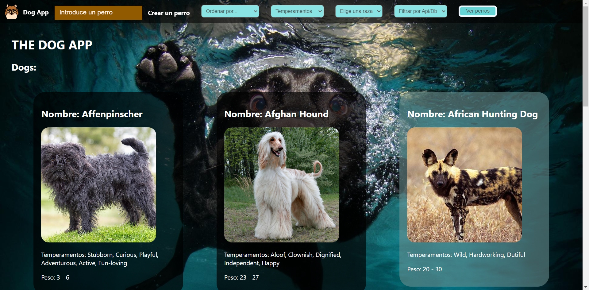
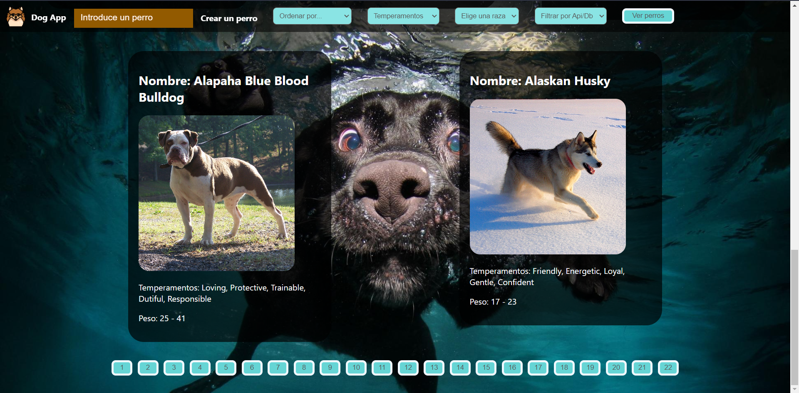
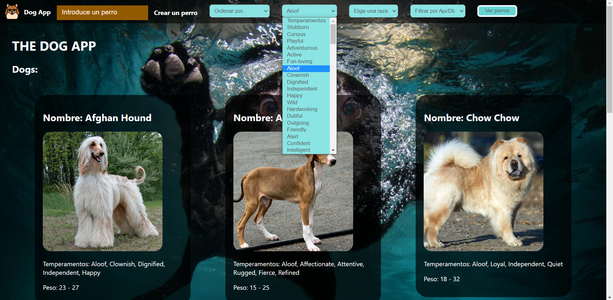
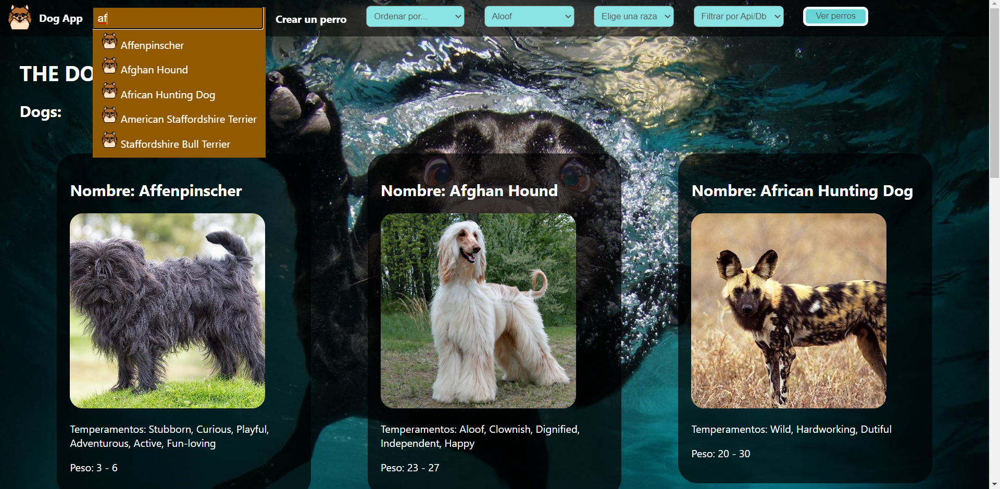
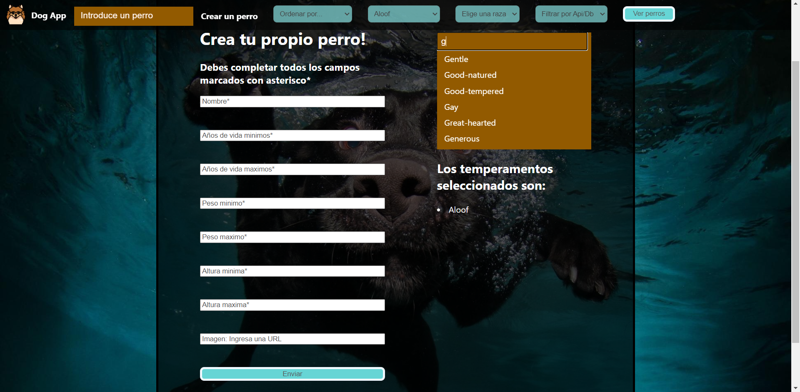
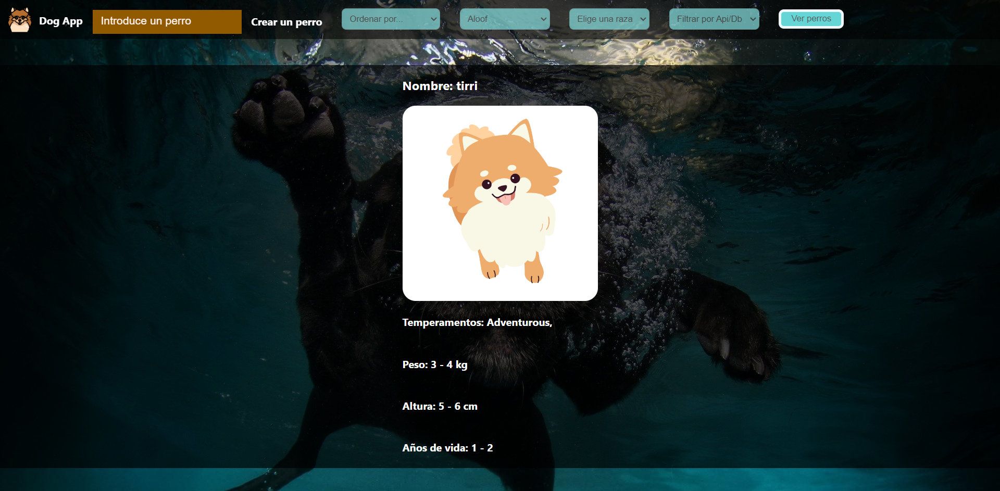

## Dog App

This app is about dogs where we can see their details, add new dogs, search them and other functionalities that
we can apreciate in the next images.
This page was developed with JavaScript, HTML, CSS, Redux.js, React, Express, SQL and Sequelize, front-end
and back-end as we can see.
All the dogs come from the api https://thedogapi.com/ (except the ones we create). All the temperaments and the created dogs are stored in the database (SQL)
and managed by Sequelize.js.
The next step is deploying and adding some fun functionalities! Hope you like my page.

